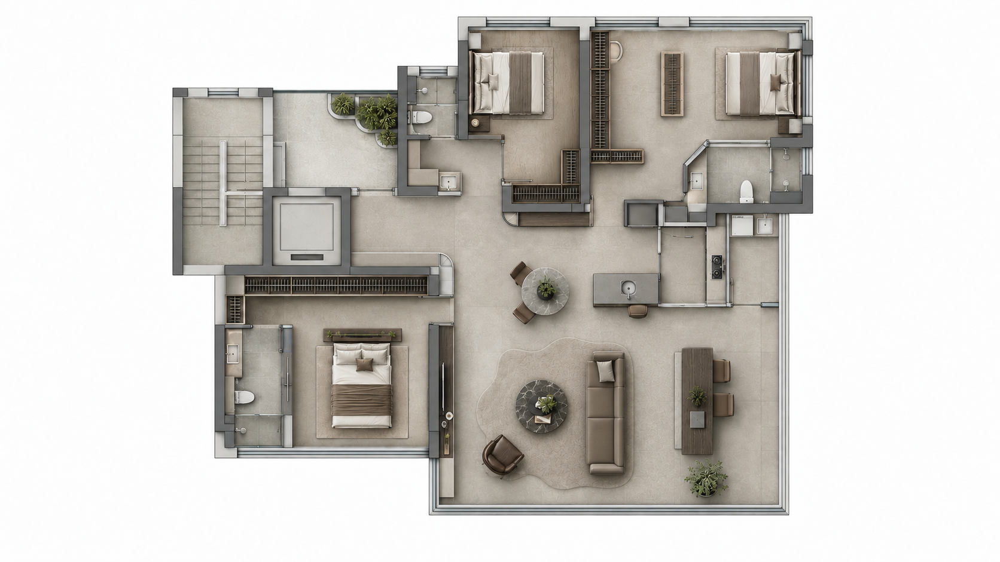

# 住宅平面转彩平与效果图

**当前正式版：v1.3.2 · MIT**

上传 CAD、PDF 或平面图片。AI 先整理平面，与你确认疑点，再制作彩平和室内效果图。

可以完成全流程。也可以从已确认的整理平面或彩平继续。

[下载正式版](https://github.com/yangplato/cad-plan-to-room-render/releases/tag/v1.3.2) · [查看 Skill](SKILL.md) · [查看参考图](references/image-references.md)



## 怎样开始

提供你已有的资料。说明要做哪些房间和风格。
不必先准备 JSON、三维模型或完整设计说明。

| 你提供什么 | AI 先做什么 |
|---|---|
| CAD 文件 | 检查能否读取，展示目标平面。有多套方案时，请你选择。 |
| 平面图片或 PDF | 检查图面是否完整、清晰，展示识别结果和疑点。 |
| 已确认的整理平面或彩平 | 核对文件和版本，从对应阶段继续。 |
| 只提及这个 Skill | 介绍流程，询问你有什么资料。 |
| 只询问功能 | 回答问题，不开始生图。 |

不能读取 DWG 时，AI 会说明原因，并请你提供清晰的 PNG、PDF 或可读的 DXF。
没有可靠尺寸时，AI 按图面比例处理，并说明这一限制。

调用示例：

```text
使用 $cad-plan-to-room-render 处理附件平面。
我需要中古风彩平，以及客厅和餐厅的效果图。
每一步在对话中给我看成果，确认后再继续。
生图前先给我看实际输入图和完整提示词。
```

## 按四步完成

| 步骤 | AI 给你看什么 | 你确认什么 |
|---|---|---|
| 01 识别原始资料 | 目标平面、识别结果和疑点 | 使用哪套方案，疑点实际表示什么。 |
| 02 整理平面 | 干净平面、房间编号和房间物品说明 | 布局和物品含义是否正确。 |
| 03 制作彩平 | 实际输入图、完整提示词，再展示彩平 | 家具、材料、风格和画面表现。 |
| 04 制作效果图 | 镜头建议、空间约束图、完整提示词，再展示效果图 | 当前房间和角度是否通过。 |

每一步确认后，AI 再进入下一步。已确认的事实不重复询问。
多种风格分别确认。前一步的设计改变后，相关后续图需要重新检查。

完成后，AI 按风格展示彩平和效果图，并附各步实际输入和提示词。
图片和制作资料保存在同一案例文件夹。审阅和确认留在对话中。

### 只在对话中确认

AI 在当前对话直接展示图片、简短检查结果和当前问题。
你直接回复“通过”，或说明要改什么。
不需要打开审阅网页、填写表单或另存确认文件。

首次制作每种彩平或每个效果图角度前，AI 展示完整提示词。
实际发送的文字必须与你确认的文字一致。
输入图的作用必须写清，图片也必须实际传入生图工具。

同一方案的漏画或错画，由 AI 检查并修正。
改变风格、主要设计或制作范围时，AI 再向你确认。
只有你明确授权时，AI 才代你检查并继续后续步骤。
AI 自检通过不等于你已确认。

### 效果图前先做两件事

1. **确定镜头。** AI 按房间建议广角、近景或两者组合，由你选择。已指定时不重复问。
2. **制作空间约束图。** AI 按整理平面画出该镜头下的墙、门窗、家具位置和遮挡关系。

空间约束图必须能直接查看。
AI 先核对这张图，再把它作为图片传入生图工具。
缺少对应镜头的空间约束图时，不直接生成效果图。

详细流程见 [用户引导与确认](references/user-journey.md)。

## 平面固定什么，风格改变什么

| 内容 | 依据和处理方式 |
|---|---|
| 墙、门窗、通道、固定设备 | 依据原始资料和你的确认。不能为取景删墙或改洞口。 |
| 物品类别和占用位置 | 整理平面说明“哪里有什么”。图中的方块不代表成品款式。 |
| 家具款式、材料、颜色 | 彩平阶段按风格选择。在授权范围内调整尺寸和摆放，并检查使用和通行。 |
| 已指定的产品、数量或尺寸 | 按你的要求执行。 |
| 后续房间效果图 | 继承该风格已确认的彩平设计，保持家具和材料一致。 |

没有特别说明的墙统一通高。彩平的剖切不改变真实墙高。
彩平保留统一浅灰墙体剖面和抽象挂衣柜表达。
缺少立面、吊顶或细节资料时，允许补全合理、美观的设计。

## 提示词怎样组成

生图提示词按三个层级展开：

1. **整体任务。** 说明要做什么，以及每张输入图的作用。彩平调用固定母版。
2. **房间内容。** 按房间编号说明物品和已确认的布置关系。房间内部不再编号。
3. **风格要求。** 调用已定稿的完整风格提示词，不用几个风格名称代替。

本版保留 V1.2 彩平母版，采用十种风格的 r4 定稿提示词。
效果图继续使用这三个层级，并继承已确认的设计。

十种风格：当代新中式、宋式美学、奶油风、中古风、法式复古、现代简约、意式极简、意式轻奢、东南亚风格、北欧风格。

完整文字保存在 [风格模块](references/style-modules.md)，使用时不需要访问研究网站。
研究来源保存在 [维护附录](docs/style-research.md)。

## 参考图怎样使用

参考库共 30 张图片。每次只传当前步骤需要的图。

| 参考类型 | 数量 | 只参考什么 |
|---|---|---|
| 彩平表现图 | 10 张，保留原文件 | 材质表现、光影、留白和画幅。 |
| 摄影构图图 | 20 张，1024×576 | 广角景别、前中后景、视线和光影。 |

摄影图来自 V1.3 最新实测。每种风格有一张空间广角和一张正向广角。

彩平通常使用整理平面和一张彩平表现参考。
效果图使用整理平面、已确认彩平和对应镜头的空间约束图。
需要时，再加一张摄影参考。

参考图不决定本案布局，也不替代本案已确认的设计。
固定母版和完整风格提示词不因参考图改变。
图片来源和用途见 [参考说明](references/image-references.md)。

## 安装和其他平台

### 支持 Skill 文件夹的平台

1. 下载正式版，解压得到 `cad-plan-to-room-render/`。
2. 将整个文件夹放入客户端支持的 Skill 目录。保留内部文件，不只复制 `SKILL.md`。
3. 重新加载 Skill，确认客户端能找到它，再开始使用。

已有同名文件夹时，先备份，再更新。
安装目录和调用方式由客户端决定。
本包采用 [Agent Skills 文件格式](https://agentskills.io/specification)。

### 豆包、Kimi、Work Buddy 等平台

将完整包交给该平台的 AI，要求它从 [跨平台入口](references/portability.md) 开始。
它先检查能否读取资料、查看图片、携带参考图生图和展示结果。
再按 [平台适配说明](references/adapter-contract.md) 对接实际可用工具。

本 Skill 提供流程、提示词和参考资料。目标平台负责调用模型和工具。
缺少必要能力时，AI 应说明缺项，并交付待执行资料。
写出本地图片路径不等于已把图片传给模型。

## 已验证范围

本版采用经用户试用确认的 V1.2 彩平母版、十风格 r4 提示词和对话确认流程。
当前案例用于验证这些做法。它们不证明所有户型和平台都能得到同样结果。

生图模型仍可能漏画、误画或改变空间。每张图生成后都需要对照原资料检查。
空间约束图帮助说明关系，不能保证模型一次画对。
本包尚未在豆包、Kimi、Work Buddy 完成全流程验证。

具体范围见 [验证说明](examples/validation.md) 和 [历史质量对照](references/quality-calibration.md)。

## 执行和维护文件

| 文件 | 用途 |
|---|---|
| [SKILL.md](SKILL.md) | AI 的执行入口。 |
| [平面整理](references/prepare-plan.md) | 识别原图，整理平面，确认疑点。 |
| [彩平母版](references/color-plan.md) | 生成彩平的固定要求。 |
| [空间与摄影方法](references/room-render.md) | 镜头、空间约束图和效果图检查。 |
| [运行记录](references/run-record.md) | 保存实际输入、提示词和制作状态。确认仍留在对话中。 |
| [可选数据工具](references/scene-contract.md) | 读取 DXF、检查 JSON、回绘平面。普通图片任务不需要安装 CAD 依赖。 |

修改工具代码时，运行相关测试：

```bash
python3 -m unittest discover -s tests -v
```

合成测试数据只检查工具行为，不证明生图准确。
新增规则应对应一个实际问题。新增参考图应说明来源和用途。
制作记录应保存实际发送的提示词，不用后改的模板替代。

仓库根目录就是完整 Skill 文件夹。
本包不含客户 DWG、密钥或 DWG 转换器。
用户资料不自动上传到新的第三方平台。

[MIT 许可](LICENSE) · [图片及第三方来源说明](NOTICE.md)
