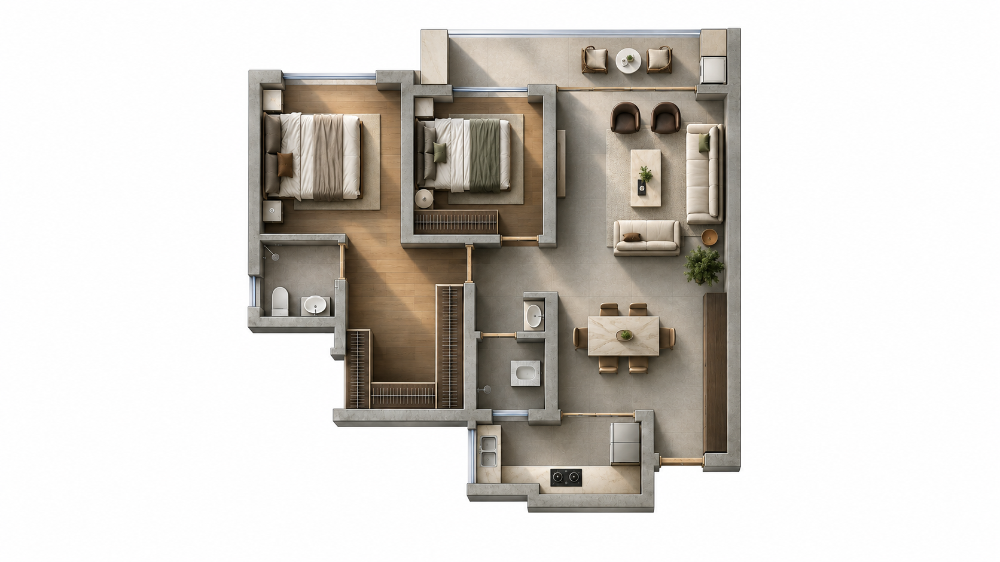

# CAD Plan to Room Render

**从住宅平面到多风格彩平，再到保持空间关系的室内摄影效果图。**

一个可携带的 Agent Skill：核实平面事实、按风格选择家具、用摄影表达空间。支持原始CAD或导出平面，不把家具占位模型的盒子造型当成最终设计。

**v1.3.1 · MIT · 2026-10-07**。更新完整十风格r4模块与交互流程，保留V1.2彩平质感。用户已实测并认可流程基本可用；本版固定效果图前的景别确认与空间约束图，所有审阅和确认仅在对话中完成。不承诺每个模型一次成功。



## 开始使用

你只需提供当前有的资料，不必先准备JSON、模型或完整设计说明。

| 你怎样开始 | Agent接下来应做什么 |
|---|---|
| 上传CAD | 先检查能否读取、是否有多套方案，展示目标平面的识别预览；需要选方案或澄清符号时只问当前问题。不能读DWG时说明原因，引导导出清晰PNG/PDF或可读DXF。 |
| 上传平面图片/PDF | 检查完整性与清晰度，展示识别结果和具体疑点；没有可靠尺寸时按比例处理，不虚报精度。 |
| 只@这个Skill | 简述四步及每步确认方式，询问你现有CAD、图片还是想先了解流程；不会立即开始整套生图。 |
| 只询问功能 | 回答你问的能力与限制，提供一个开始方式；不会把咨询视为制作授权。 |
| 已有确认过的底图或彩平 | 核对文件、用途和版本后承接后续，不要求从头重做。 |

正常使用时，Agent在当前对话直接展示**成果图片＋简短检查说明＋一个当前问题**，你用普通回复确认或提出修改。首次生图前，实际输入和完整提示词也在对话中展示。不为审阅和确认另建HTML、Markdown、PDF、表单或记录文件。整理图只给房间编号，不给内部家具或功能区编号。同方案漏画、错画由Agent按已有授权自行处理。详细交互规则见 [用户引导与逐步确认](references/user-journey.md)。

### 支持 Skill 文件夹的 Agent

下载完整包，解压得到 `cad-plan-to-room-render/`，保留其内部结构。把这一整个文件夹放到目标Agent支持的Skill目录；不要只复制SKILL.md。以支持用户级 `.agents/skills` 的客户端为例，在解压目录执行：

```bash
mkdir -p ~/.agents/skills
# 目标已存在时先比较版本并备份，不覆盖正在使用的版本。
test ! -e ~/.agents/skills/cad-plan-to-room-render && cp -R cad-plan-to-room-render ~/.agents/skills/
```

其他客户端按其实际支持的Skill路径安装。格式遵循 [Agent Skills 规范](https://agentskills.io/specification)，安装位置与调用方式由各宿主决定。Codex可用其Skills设置或支持的本地Skill目录；没有看到新Skill时刷新/重开会话后检查，不以“文件已复制”代替已加载。

调用示例：

```text
使用 $cad-plan-to-room-render 处理附件平面。我希望做中古风彩平，以及客厅、餐厅和一间卧室的效果图。先给我识别预览，每一步成果确认后再往下做；最终按风格分组，并附每一步实际Prompt。
```

### 豆包、Kimi、Work Buddy及其他平台

把完整包交给目标平台的Agent，从 [跨平台入口](references/portability.md) 开始。它按 [适配契约](references/adapter-contract.md) 核实本地能力，映射真实工具、附件、任务状态和成果确认，再执行当前阶段。契约是数据与行为约定，**不是各平台都能直接调用的API**；核心Skill不绑定某个模型或服务。

平台不支持完整文件夹时，由Agent整理当前阶段的执行包或说明缺项。仅传本地路径不等于已传图片；无法生图时交付待执行资料，不冒充成图。**尚未在豆包、Kimi、Work Buddy完成同等整链验收。**

## 四步成果确认

| 阶段 | 交给你看的成果 | 确认后做什么 |
|---|---|---|
| 01 原始资料识别 | 目标方案预览、识别摘要、需澄清位置 | 确认目标与关键事实，开始整理 |
| 02 整理平面 | 实际编号底图、房间物品说明与局部疑点 | 确认布局与物件表达，再进入所选风格彩平 |
| 03 彩平 | 先确认实际输入与完整提示词；再审阅彩平、家具与材料 | 确认这一套设计，再延伸指定房间 |
| 04 空间效果图 | 先选广角/近景或组合；制作并核对对应约束图；确认实际输入与完整提示词；再审阅房间图 | 确认当前房间/批次，继续约定范围或交付 |

每次确认绑定你看到的成果版本；多风格分别确认，改上游后相关下游需重新核对。Agent自检通过不等于用户接受。“做全流程”仍保留四步确认；明确说“中间不用等我，由你代检推进”才按委托范围继续，并记录为委托自检。已明确确认的版本不重复询问。

效果图生成前必须先确认景别，再制作并核对对应机位的空间约束图，并将该图实际传入。用户已指定镜头时不重复问；没有约束图不能直接生图。约束图说明空间与遮挡，不规定家具款式，也不是准确度保证。

原CAD与核实平面确定墙门窗、连通、固定设备、物品类别、占位和必要使用关系。用户已确认的数量、形状与方向继续保留。家具构造、材质及授权范围内的尺寸和摆放在彩平阶段按风格选择；房间效果图继承该套已选设计。默认通高墙、统一浅灰水泥剖面、线性抽象挂衣图示、正确洗衣机顶视面。缺少立面可以合理补全设计。

内置十张r4风格示例、两张V1.2彩平质感下限与一张摄影示例。通常只传“本案整理平面＋当前风格的一张适用参考”，不上传整库。图1提供物品和空间；图2提供明确注明的家具、材料、配色、植物、陈设与质感，不能提供本案布局。完整文字仍需展开。r4认可的是风格表达，不是准确度；没有证明纯文字可稳定达到相同质量。用途见[参考说明](references/image-references.md)，既有测试见[质量对照](references/quality-calibration.md)。

十种风格：当代新中式、宋式美学、奶油风、中古风、法式复古、现代简约、意式极简、意式轻奢、东南亚风格、北欧风格。形态、材料、搭配与可复制段落保存在 [离线风格模块](references/style-modules.md) 中；十个模块采用本项目已认可的r4风格要求，不用图片或几个风格词替代正文。研究链接及解释集中在[维护附录](docs/style-research.md)，普通生成不加载，执行不依赖访问外站。

## 文件入口

- [SKILL.md](SKILL.md)：Agent入口和不可漂移的工作规则。
- [01–02 平面识别与整理](references/prepare-plan.md) / [03 彩平母版](references/color-plan.md) / [04 摄影方法](references/room-render.md)：阶段执行和Prompt。
- [参考样张及作用](references/image-references.md) / [运行记录](references/run-record.md)：真实传图、选型承接与结果核验。
- [可选结构化工具](references/scene-contract.md)：只读DXF清单，JSON校验与动态SVG回绘；不自动猜语义，不含95㎡硬编码。
- [验证范围与下个案例](examples/validation.md)：本次通过和仍需实测的边界。

## 工具验证

基础工具只需Python标准库；最低版本及完整命令以 [数据约定](references/scene-contract.md) 为准。DXF清单功能另需 `ezdxf`，仅在使用时安装；不需要为了普通PNG生图安装CAD依赖。

```bash
python3 -m unittest discover -s tests -v
python3 scripts/scene_tools.py --help
python3 scripts/inspect_dxf.py --help
```

`examples/synthetic-scene.json` 是匿名合成数据，只验证代码行为。检查报告不等于家具无碰撞、房间连通正确或生成图精准；这些必须结合原始资料实际看图核实。

## 发布与贡献

仓库根就是Skill目录。提交新规则前，用一个真正遇到的问题说明它改善了哪个决策；通用规则、个案信息和风格选型分开。新增脚本运行相关测试，新增参考说明来源和作用，避免附私有CAD、客户身份信息或未获授权图库。模型生成结果记录实际Prompt，不用后来改写的模板代替。

仓库与Release提供完整Skill包；发布前检查材料适合公开。本包不含密钥、DWG转换器或客户DWG，也不授权自动向新的第三方服务传输用户资料。

[MIT许可](LICENSE) · [图片及第三方来源说明](NOTICE.md)。
